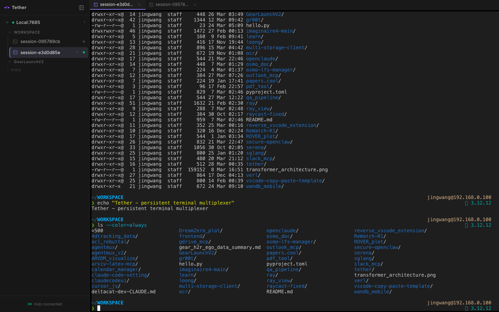

<p align="center">
  
  
  
  
  
</p>

<h1 align="center">
  <br>
  
  <br>
  Tether
  <br>
</h1>

<h4 align="center">Tether's organized terminal interface — GPU-accelerated, Metal-native rendering.</h4>

<p align="center">
  <a href="#why">Why</a> •
  <a href="#features">Features</a> •
  <a href="#architecture">Architecture</a> •
  <a href="#quick-start">Quick Start</a> •
  <a href="#building-the-terminal-library">Building the terminal library</a> •
  <a href="#project-structure">Project Structure</a>
</p>

<p align="center">
  
</p>

---

## Why?

[Tether](../Tether) uses `xterm.dart` — a JavaScript-lineage terminal renderer ported to Dart. It works everywhere but carries the limitations of a software renderer: font hinting artifacts, ligature gaps, and a rendering budget that competes with Flutter's own frame budget.

**Tether** replaces the terminal widget with a GPU-accelerated, Metal-native rendering core. The result is pixel-perfect text, zero-compromise font rendering, and a PTY stack that runs entirely in-process via a Zig-compiled static library. The sidebar, session management, SSH awareness, and group hierarchy are unchanged — they're the same Tether code talking to the same Rust server.

## Features

### GPU-Accelerated Rendering
- **Metal rendering** — libghostty renders directly to a CAMetalLayer; Flutter composites on top. No pixel readback, no CPU blitting.
- **Pixel-perfect fonts** — subpixel hinting, ligatures, Nerd Font glyphs, and bitmap emoji all rendered by Ghostty's font pipeline (CoreText + custom rasterizer)
- **Event-driven draw loop** — libghostty's `wakeup_cb` triggers redraws only when the terminal state changes; idle sessions consume no GPU budget
- **True color + 256-color** — full VT/xterm-256 palette, 24-bit RGB, and italics

### Terminal
- **Local PTY** — spawned in-process by libghostty via `posix_openpt`; no external process manager needed for basic use
- **Full keyboard support** — modifier keys, arrow keys, function keys, Ctrl combos, dead keys, IME input
- **Bracketed paste** — handled internally by libghostty; `Cmd+V` routes through the native pasteboard
- **Scrollback** — managed inside libghostty's PageList (same implementation as Ghostty app)
- **Session titles** — OSC 0/2 escape sequences update tab names automatically; PUA/Nerd Font glyphs stripped before display

### Organization (from Tether)
- **Hierarchical groups** — nested folders with inherited working directories
- **Persistent sessions** — metadata (name, shell, cwd, group) survives restarts via SQLite
- **Drag & drop tabs** — reorder sessions within the tab bar
- **SSH host association** — bind groups to SSH hosts; open a session with `ssh host` as the command
- **Session presets** — one-click launch for Claude Code, custom shells, or arbitrary commands

### Platform
- **macOS native** — Apple Silicon (aarch64) with a direct Metal surface; no Rosetta, no translation layer
- **Pluggable backend** — `TerminalBackend` abstraction; macOS uses `NativeBackend`, other platforms fall back to `XtermBackend`

## Architecture

```
Flutter App (Dart / macOS)
┌─────────────────────────────────────────────────────┐
│  HomeScreen                                          │
│  ┌──────────────┐   ┌────────────────────────────┐  │
│  │   Sidebar    │   │       TerminalArea          │  │
│  │  (groups,    │   │  ┌──────────────────────┐   │  │
│  │   sessions,  │   │  │  TerminalView         │   │  │
│  │   SSH)       │   │  │  AppKitView (native)  │   │  │
│  │              │   │  └──────────────────────┘   │  │
│  │  Riverpod    │   │  MethodChannel: input        │  │
│  │  providers   │   │  EventChannel:  title/exit   │  │
│  └──────────────┘   └────────────────────────────┘  │
└─────────────────┬───────────────────────────────────┘
                  │ HTTP (REST only — metadata)
                  ▼
┌─────────────────────────────────────────────────────┐
│  tether-server  (Rust / Axum)                        │
│  ┌──────────────────────────────────────────────┐   │
│  │ REST API                                      │   │
│  │  /api/groups  /api/sessions?local=true        │   │
│  │  /api/ssh/hosts  /api/completions             │   │
│  ├──────────────────────────────────────────────┤   │
│  │ SQLite — groups, sessions (metadata only)     │   │
│  │ No PTY spawn for local sessions               │   │
│  └──────────────────────────────────────────────┘   │
└─────────────────────────────────────────────────────┘

macOS Native  (Swift + libghostty.a)
┌─────────────────────────────────────────────────────┐
│  TerminalPlugin  FlutterPlatformViewFactory          │
│  TerminalApp     singleton ghostty_app_t             │
│  TerminalView    NSView subclass                     │
│  ├── ghostty_surface_t  (PTY + Metal, in libghostty) │
│  └── wakeup_cb → ghostty_app_tick() → surface_draw() │
└─────────────────────────────────────────────────────┘

libghostty.a  (Zig — compiled from ghostty-org/ghostty)
    ghostty_init / ghostty_app_new / ghostty_surface_new
    ghostty_surface_draw / ghostty_surface_set_size
    ghostty_surface_key / ghostty_surface_text
    ghostty_surface_mouse_* / ghostty_surface_free
```

**Key design choices:**

- **No WebSocket** — tether-server is used for metadata (groups, session names, SSH hosts) only. The terminal I/O lives entirely in-process and never leaves the app.
- **`?local=true`** — sessions created with this flag are stored in SQLite but skip `PtySession::spawn()`; the PTY is owned by the native terminal library on the client side.
- **Event-driven rendering** — the terminal library calls `wakeup_cb` from any thread when it has output to paint. A coalescing dispatcher on the main queue calls `ghostty_app_tick()` then redraws only the active surface. Offstage tabs are unregistered from the drawable set so they don't burn GPU time.

## Quick Start

### Prerequisites

```bash
brew install zig          # 0.13+
brew install flutter      # 3.7+
brew install rust         # 1.75+
```

### 1. Build the terminal library

```bash
./scripts/build_libghostty.sh
# Clones ghostty-org/ghostty at v1.1.3, builds with zig, copies:
#   flutter_app/macos/Runner/ghostty/libghostty.a
#   flutter_app/macos/Runner/ghostty/ghostty.h
```

### 2. Start the metadata server

```bash
cargo run -p tether-server -- --port 7680
```

### 3. Run the app

```bash
cd flutter_app
flutter pub get
cd macos && pod install && cd ..
flutter run -d macos
```

> The app connects to `http://localhost:7680` automatically. Create a group, open a session — you get a full Metal-rendered terminal inside the Tether UI.

## Building the terminal library

The build script pins a specific release tag and produces a fat-free `aarch64-macos` static library:

```bash
# Default tag (v1.1.3)
./scripts/build_libghostty.sh

# Override tag
GHOSTTY_TAG=v1.1.4 ./scripts/build_libghostty.sh
```

The script:
1. Clones `ghostty-org/ghostty` at the pinned tag into `.ghostty_build/` (reuses existing checkout on subsequent runs)
2. Runs `zig build -Doptimize=ReleaseFast -Dtarget=aarch64-macos libghostty`
3. Copies `libghostty.a` and `ghostty.h` into `flutter_app/macos/Runner/ghostty/`

The `.ghostty_build/` directory is excluded from git. Rebuild only when upgrading Ghostty.

## Project Structure

```
tether/
├── crates/
│   └── tether-server/
│       └── src/
│           ├── api/               # REST endpoints — groups, sessions (?local=true), SSH, completions
│           ├── pty/               # PTY lifecycle (skipped for local sessions)
│           ├── persistence/       # SQLite — groups, sessions metadata
│           ├── ws/                # WebSocket handler (unused by native macOS client)
│           ├── server.rs          # Axum router
│           ├── config.rs          # TOML config
│           ├── auth.rs            # Bearer token middleware
│           └── ssh_config.rs      # ~/.ssh/config parser
├── flutter_app/
│   ├── lib/
│   │   ├── main.dart              # Backend selection: NativeBackend (macOS) / XtermBackend
│   │   ├── platform/
│   │   │   ├── terminal_backend.dart   # Abstract TerminalBackend interface
│   │   │   ├── native_backend.dart     # macOS: wraps TerminalView
│   │   │   ├── key_map.dart            # LogicalKeyboardKey → terminal key names
│   │   │   └── xterm_backend.dart      # Fallback / Android stub
│   │   ├── widgets/
│   │   │   ├── sidebar/           # Groups, sessions, SSH hosts (from Tether, unchanged)
│   │   │   └── terminal/
│   │   │       ├── terminal_view.dart        # AppKitView + MethodChannel/EventChannel
│   │   │       ├── terminal_area.dart        # Tab management, title sanitization
│   │   │       └── mobile_key_bar.dart       # On-screen modifier keys (mobile)
│   │   ├── providers/             # Riverpod: server, session, UI, settings
│   │   ├── services/              # REST API client
│   │   └── models/                # Group, Session, SSHHost
│   └── macos/Runner/
│       ├── Runner-Bridging-Header.h     # #import "ghostty/ghostty.h"
│       ├── TerminalPlugin.swift         # FlutterPlugin + PlatformViewFactory
│       ├── TerminalApp.swift            # Singleton ghostty_app_t + callbacks
│       ├── TerminalView.swift           # NSView: surface lifecycle, input, events
│       ├── MainFlutterWindow.swift      # Registers TerminalPlugin
│       └── ghostty/
│           ├── ghostty.h                # C API header (ghostty library)
│           └── libghostty.a             # Built by build_libghostty.sh (not in git)
├── scripts/
│   └── build_libghostty.sh        # Zig build driver
├── demos/                         # Standalone integration demos (link → app → NSView → Flutter)
│   ├── demo1_link/                # Swift CLI: ghostty_init() links
│   ├── demo2_app/                 # ghostty_app_new() + stub callbacks
│   ├── demo3_nsview/              # Full terminal in a bare AppKit window
│   ├── demo4_flutter_view/        # PlatformView infra validation (no libghostty)
│   └── demo5_integration/         # Flutter + libghostty + MethodChannel input
└── Cargo.toml                     # Workspace root
```

## Tech Stack

| Layer | Technology |
|-------|-----------|
| Terminal engine | [libghostty](https://ghostty.org) (Zig), compiled as `libghostty.a` |
| GPU rendering | Metal (via libghostty's CAMetalLayer) |
| Native bridge | Swift, `FlutterPlatformView`, `MethodChannel`, `EventChannel` |
| App framework | Flutter 3.7, Dart, Riverpod 2.6 |
| Metadata server | Rust, Axum 0.8, SQLite (rusqlite) |
| Font rendering | CoreText + Ghostty's custom rasterizer |
| Build toolchain | Zig 0.13 (for libghostty), Cargo (server), Flutter (app) |

## License

MIT
